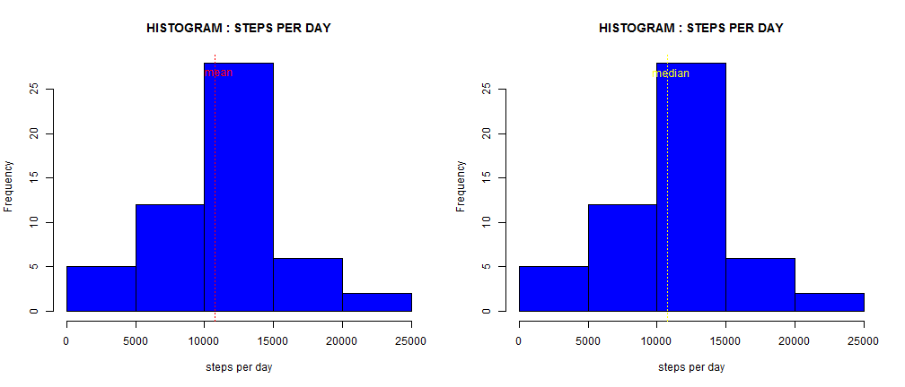
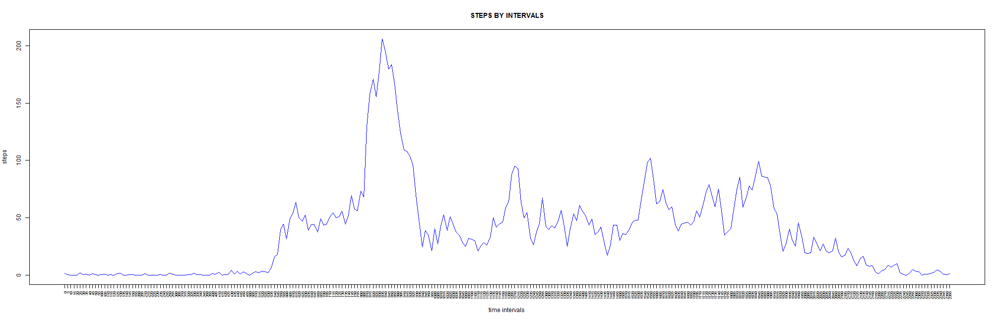
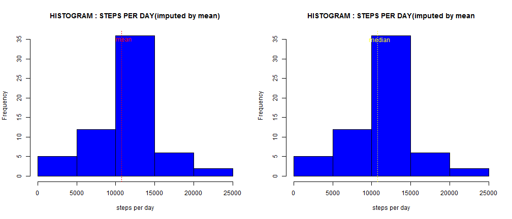
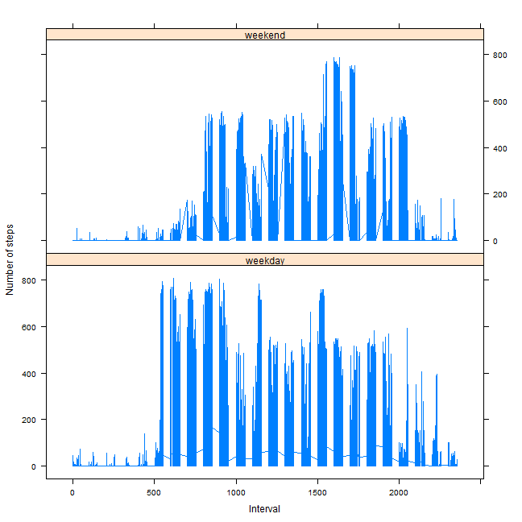

# Reproducible Research: Peer Assessment 1

## Data 
" The variables included in this dataset are:
steps: Number of steps taking in a 5-minute interval (missing values are coded as NA)
date: The date on which the measurement was taken in YYYY-MM-DD format
interval: Identifier for the 5-minute interval in which measurement was taken 
The dataset is stored in a comma-separated-value (CSV) file and there are a total of 17,568 observations in this dataset" [1]

## Loading and preprocessing the data

```r
# Loading Data into a data frame 'activity'
activity <- read.csv("activity.csv")
# Exploring the data
summary(activity)
```

```
##      steps               date          interval   
##  Min.   :  0.0   2012-10-01:  288   Min.   :   0  
##  1st Qu.:  0.0   2012-10-02:  288   1st Qu.: 589  
##  Median :  0.0   2012-10-03:  288   Median :1178  
##  Mean   : 37.4   2012-10-04:  288   Mean   :1178  
##  3rd Qu.: 12.0   2012-10-05:  288   3rd Qu.:1766  
##  Max.   :806.0   2012-10-06:  288   Max.   :2355  
##  NA's   :2304    (Other)   :15840
```

```r
dim(activity)
```

```
## [1] 17568     3
```

```r
str(activity)
```

```
## 'data.frame':	17568 obs. of  3 variables:
##  $ steps   : int  NA NA NA NA NA NA NA NA NA NA ...
##  $ date    : Factor w/ 61 levels "2012-10-01","2012-10-02",..: 1 1 1 1 1 1 1 1 1 1 ...
##  $ interval: int  0 5 10 15 20 25 30 35 40 45 ...
```

```r
# Preprocessing data to obtain a data frame 'act' showing number of steps
# for each day
tsum <- tapply(activity[, 1], activity[, 2], sum)
tdates <- levels(activity[, 2])
act <- data.frame(cbind(tdates, tsum))
colnames(act) <- c("Dates", "Total Steps")
rownames(act) <- c(1:61)
```


## What is mean total number of steps taken per day?


```r
# Histogram for total number of steps taken each day Drawing the same
# histogram twice, showing mean in first and median in second
```


```r
par(mfrow = c(1, 2))
hist(as.numeric(as.character(act[, 2])), col = "blue", xlab = "steps per day", 
    main = "HISTOGRAM : STEPS PER DAY")
abline(v = mean(as.numeric(as.character(act[, 2])), na.rm = TRUE), lty = 3, 
    col = "red")
text(11000, 27, "mean", col = "red")
hist(as.numeric(as.character(act[, 2])), col = "blue", xlab = "steps per day", 
    main = "HISTOGRAM : STEPS PER DAY")
abline(v = median(as.numeric(as.character(act[, 2])), na.rm = TRUE), lty = 3, 
    col = "yellow")
text(11000, 27, "median", col = "yellow")
```

 


```r
# Calculating mean number of total steps taken per day
mean_na <- mean(as.numeric(as.character(act[, 2])), na.rm = TRUE)
# Calculating median number of total steps taken per day
median_na <- median(as.numeric(as.character(act[, 2])), na.rm = TRUE)
```

Thus the **mean total number of steps taken per day (ignoring missing values)** are given by :

```r
mean_na
```

```
## [1] 10766
```

Thus the **median total number of steps taken per day (ignoring missing values)** are given by :

```r
median_na
```

```
## [1] 10765
```


## What is the average daily activity pattern?


```r
# Removing the NA values
act_clean <- na.omit(activity)
# Creating data frame 'agg' containing average number of steps for each
# interval (averaged over all days)
agg <- data.frame(tapply(act_clean[, 1], act_clean[, 3], mean))
agg[, 2] <- rownames(agg)
colnames(agg) <- c("average", "interval")
rownames(agg) <- c(1:nrow(agg))
```


```r
# Time series plot of the 5-minute interval (x-axis) and the average number
# of steps taken, averaged across all days (y-axis)
```


```r
plot(agg[, 1], type = "l", col = "blue", xaxt = "n", xlab = "time intervals", 
    ylab = "steps", main = "STEPS BY INTERVALS")
axis(1, at = seq_along(agg[, 2]), labels = agg[, 2], cex.axis = 0.6, las = 2)
```

 


```r
# Code for calculating Which 5-minute interval, on average across all the
# days in the dataset, contains the # maximum number of steps
max.int <- agg[agg[, 1] == max(agg[, 1]), ]
max.int
```

```
##     average interval
## 104   206.2      835
```

```r
t1 <- as.numeric(max.int[2])
t2 <- t1 + 5
max.time.int <- c(t1, t2)
```


Thus the **5-minute interval**, on average across all the days in the dataset, **that contains the maximum number of steps** is :

```r
max.time.int
```

```
## [1] 835 840
```


## Imputing missing values

The number of **missing values (NAs)** are : 

```r
# Calculate and report the total number of missing values in the dataset
# (i.e. the total number of rows with NAs)
sum(is.na(activity))
```

```
## [1] 2304
```


```r
# Creating a new dataset 'act.imp.mean' that is equal to the original
# dataset but with the missing data filled in imputed by the mean values
# over intervals, using the package('plyr)'
require(plyr)
imp.mean <- function(x) replace(x, is.na(x), mean(x, na.rm = TRUE))
act.imp.mean <- ddply(activity, ~interval, transform, steps = imp.mean(steps))
# Creating a data frame 'act_mean_imp' showing total steps for each day
tsum <- tapply(act.imp.mean[, 1], act.imp.mean[, 2], sum)
tdates <- levels(act.imp.mean[, 2])
act_mean_imp <- data.frame(cbind(tdates, tsum))
colnames(act_mean_imp) <- c("Dates", "Total Steps")
rownames(act_mean_imp) <- c(1:61)
```


```r
# Histogram for total number of steps taken each day (using imputation by
# mean of intervals across days) Drawing the same histogram twice, marking
# mean of total steps taken each day in first and marking median of total
# steps taken each day in second
```


```r
par(mfrow = c(1, 2))
hist(as.numeric(as.character(act_mean_imp[, 2])), col = "blue", xlab = "steps per day", 
    main = "HISTOGRAM : STEPS PER DAY(imputed by mean)")
abline(v = mean(as.numeric(as.character(act_mean_imp[, 2])), na.rm = TRUE), 
    lty = 3, col = "red")
text(11000, 35, "mean", col = "red")
hist(as.numeric(as.character(act_mean_imp[, 2])), col = "blue", xlab = "steps per day", 
    main = "HISTOGRAM : STEPS PER DAY(imputed by mean")
abline(v = median(as.numeric(as.character(act_mean_imp[, 2])), na.rm = TRUE), 
    lty = 3, col = "yellow")
text(11000, 35, "median", col = "yellow")
```

 


```r
# Calculating and reporting mean of total steps taken each day (imputed by
# mean across each interval)
mean_imp.by.mean <- mean(as.numeric(as.character(act_mean_imp[, 2])))
mean_imp.by.mean
```

```
## [1] 10766
```

```r
# Calculating and reporting median of total steps taken each day (imputed by
# mean across each interval)
median_imp.by.mean <- median(as.numeric(as.character(act_mean_imp[, 2])))
median_imp.by.mean
```

```
## [1] 10766
```

```r
# Creating a data frame 'df' which shows the comparative values of means and
# medians for the two cases: i.e by removing NAs (first column) and values
# imputed by mean across intervals (second column)
means <- cbind(mean_na, mean_imp.by.mean)
medians <- cbind(median_na, median_imp.by.mean)
df <- data.frame(rbind(means, medians))
colnames(df) <- c("na_removed", "imputed_by_mean")
rownames(df) <- c("means", "medians")
```


The data frame showing the **comparative values of means and medians** of the total number of steps taken each day for 
the case *neglecting NAs (column 1 of df)* 
and the case *imputing NAs by means for intervals (column2 of df)*

```r
df
```

```
##         na_removed imputed_by_mean
## means        10766           10766
## medians      10765           10766
```


## Are there differences in activity patterns between weekdays and weekends?


```r
# Create a new factor variable in the dataset with two levels - 'weekday'
# and 'weekend' indicating whether # a given date is a weekday or weekend
# day.
require(plyr)
act.imp.mean[, 4] <- as.factor(weekdays(as.POSIXct(act.imp.mean[, 2])))
table(act.imp.mean[, 4])
```

```
## 
##    Friday    Monday  Saturday    Sunday  Thursday   Tuesday Wednesday 
##      2592      2592      2304      2304      2592      2592      2592
```

```r
levels(act.imp.mean[, 4])
```

```
## [1] "Friday"    "Monday"    "Saturday"  "Sunday"    "Thursday"  "Tuesday"  
## [7] "Wednesday"
```

```r
act.imp.mean[, 4] <- mapvalues(act.imp.mean[, 4], from = c("Monday", "Tuesday", 
    "Wednesday", "Thursday", "Friday", "Saturday", "Sunday"), to = c("weekday", 
    "weekday", "weekday", "weekday", "weekday", "weekend", "weekend"))
colnames(act.imp.mean) <- c("steps", "date", "Interval", "day")
head(act.imp.mean)
```

```
##    steps       date Interval     day
## 1  1.717 2012-10-01        0 weekday
## 2  0.000 2012-10-02        0 weekday
## 3  0.000 2012-10-03        0 weekday
## 4 47.000 2012-10-04        0 weekday
## 5  0.000 2012-10-05        0 weekday
## 6  0.000 2012-10-06        0 weekend
```


```r
# library(lattice) is required for creating the plot
require(lattice)
```


```r
# Creating a panel plot containing a time series plot of the 5-minute
# interval (x-axis) and the average number of steps taken, averaged across
# all weekday days or weekend days (y-axis).
xyplot(steps ~ Interval | day, data = act.imp.mean, layout = c(1, 2), type = "l", 
    ylab = "Number of steps")
```

 


As is evident from the plot above,the data suggests that the distribution of Number of steps across Intervals is comparatively more uniform for weekday as compared to weekend. Also the data suggests that the intervals during which more total number of steps have been taken are during the earlier part of the day for a weekday as compared to a weekend.

## REFERENCES :
1. https://class.coursera.org/repdata-002/human_grading/view/courses/972084/assessments/3/submissions
